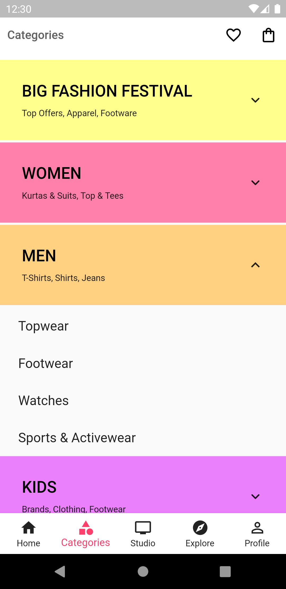

# flutter_myntra_clone

[Myntra](https://play.google.com/store/apps/details?id=com.myntra.android) clone in Flutter. Show some :heart: by :star: repo, if you liked it or you learnt something from it.

## Screenshots
### MYNTRA

Login               |  OTP                       | Home 1                            |  Home 2 
:-------------------------:|:-------------------------:|:-------------------------:|:-------------------------:
||||

Home 3               |  Home 4                       | Categories                            |  Product List 
:-------------------------:|:-------------------------:|:-------------------------:|:-------------------------:
||||

Product details               |  Product details 2    
:-------------------------:|:-------------------------:
||